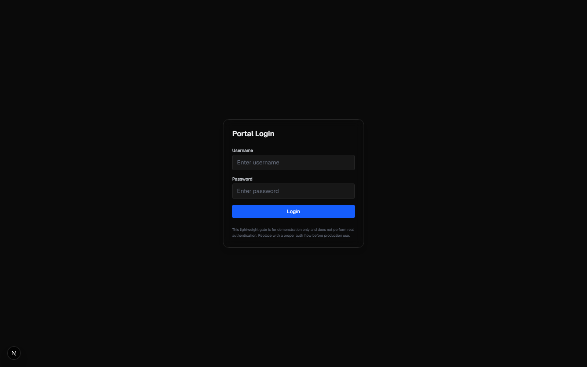

# Pulse 360° - Comprehensive Microsoft Administration Portal

> **🎯 A unified portal for IT professionals and MSPs to manage Microsoft 365, Azure, Intune, and Power Platform from a single interface**

[](https://nextjs.org/)
[](https://reactjs.org/)
[](LICENSE)

A powerful, modern web application built with Next.js that provides comprehensive administration and monitoring capabilities for Microsoft environments. Perfect for IT departments and Managed Service Providers (MSPs) managing multiple client tenants.



## 📖 Documentation

- **[Feature Walkthrough](docs/FEATURE-WALKTHROUGH.md)** - Detailed guide showing how each feature solves real IT/MSP problems
- **[Screenshot Gallery](docs/screenshots/README.md)** - Visual tour of all pages and features
- **[Installation Guide](docs/quick-start.md)** - Step-by-step setup instructions
- **[API Documentation](docs/API-DOCUMENTATION.md)** - API endpoints and integration details

## 🚀 Quick Start

### Prerequisites
- Node.js 18 or later
- Azure AD App Registration with appropriate Microsoft Graph API permissions
- Optional: Power Platform delegated permissions for environment management

### Installation

```bash
# Clone the repository
git clone https://github.com/russrimm/PortalofPortals.git
cd PortalofPortals

# Install dependencies
npm install

# Create environment configuration
cp .env.example .env.local
# Edit .env.local with your Azure AD credentials

# Run development server
npm run dev

# Open http://localhost:3000
```

See [Quick Start Guide](docs/quick-start.md) for detailed setup instructions.

## 🎯 Key Features at a Glance

| Category | Features | Screenshot |
|----------|----------|------------|
| **Dashboard** | Unified navigation, dark mode, quick access | [View](docs/screenshots/home.png) |
| **Identity** | Users, groups, service principals, enterprise apps | [View](docs/screenshots/users.png) |
| **Security** | Secure Score, risky users, Defender ATP, conditional access | [View](docs/screenshots/secure-score.png) |
| **Devices** | Intune management, compliance, Windows updates | [View](docs/screenshots/device-management__compliance-status.png) |
| **Azure** | Resource explorer, Advisor, cost management | [View](docs/screenshots/azure__resources.png) |
| **Power Platform** | Environments, capacity, DLP, inventory, Dataverse | [View](docs/screenshots/power-platform__environments.png) |
| **ServiceNow** | Incidents, knowledge base, Table API integration | N/A |
| **Fabric** | Workspaces, warehouses, unified analytics | N/A |
| **Observability** | Application Insights, OpenTelemetry, Log Analytics | N/A |
| **Reporting** | Service health, audit logs, usage analytics | [View](docs/screenshots/service-health.png) |

## 🚀 Features Overview

### 🔐 **Microsoft Entra ID (Azure AD) Management**
- **App Registrations**: View and manage Azure AD application registrations
- **Enterprise Applications**: Comprehensive enterprise application management
- **Service Principals**: Service principal administration and monitoring
- **User Management**: Full user lifecycle management with detailed profiles
  - User creation and management
  - Individual user detail pages with AI interaction history
  - User registration details and analytics
- **Group Management**: Azure AD group administration
- **Device Management**: Enrolled device monitoring and management

### 🛡️ **Security & Audit**
- **Audit Logs**: Complete directory audit trail
- **Sign-in Analytics**: 
  - User sign-in logs and analytics
  - Service principal sign-in monitoring
- **Conditional Access**: Policy management and blocked sign-in analysis
- **Microsoft Secure Score**: Security posture monitoring
- **Risky Users**: Identity Protection monitoring for high-risk users
- **Microsoft Defender for Endpoint**:
  - Security alerts monitoring and management
  - Device vulnerability assessment
  - Security recommendations tracking
  - Software inventory across devices
  - Machine security states
- **Vulnerability Management**:
  - NIST National Vulnerability Database (NVD) integration
  - CVE search and analysis with clickable reference links
  - Windows Update vulnerability tracking
  - Known Issues tracking for Windows Updates
  - Microsoft Security Response Center (MSRC) integration

### 📊 **Azure Resource Management**
- **Resource Graph Queries**: Advanced Azure resource discovery and analysis
- **Azure Advisor**: 
  - Security and performance recommendations
  - Advisor score monitoring
  - Cost optimization insights
- **Billing & Licensing**: Comprehensive licensing overview

### 🔧 **Device Management (Intune)**
- **Managed Devices**: Complete device inventory and management
- **Remote Actions**: Device reboot, shutdown, and sync capabilities
- **Windows Updates**: 
  - Update catalog with vulnerability information
  - Known issues tracking
  - Update compliance monitoring

### ⚡ **Power Platform Administration**
- **Environment Management**: 
  - Environment overview with tabbed interface (Summary, Details, Resources)
  - Capacity tracking and storage monitoring with historical data
  - Admin center access and management
  - Managed environment controls (enable/disable)
  - Environment deletion with safety confirmations
  - Environment state operations (enable/disable environments)
- **Power Apps**: Application inventory and management
- **Power Automate**: Flow monitoring and administration
- **Connectors**: Custom connector management and details
- **Dataverse**:
  - Table and entity management
  - Solution export with multiple output options:
    - Local download
    - Base64 clipboard copy
    - Direct integration with Power Automate flows
  - Audit log viewing and analysis
  - Conversation transcript access (Copilot Studio)
- **Environment Resources** (New Tab): 
  - Tenant-wide inventory interface with search and filtering
  - Resource counting by type with export to CSV
  - Live analytics with pie charts:
    - Resources by Environment (Top 10)
    - Resources by Owner (Top 10)
    - Recently Created Resources (24h)
  - Power Platform Inventory API integration
  - Custom query support for advanced filtering
- **Tenant Capacity**: Usage analytics and capacity planning
- **Tenant Settings**: Configuration management

### 📋 **Service Health & Monitoring**
- **Service Health**: Real-time Microsoft service status monitoring
  - Total Issues count showing degraded and extended recovery services
  - Clickable issue details with comprehensive information dialog
  - Status-based filtering and sorting
- **Service Announcements**: Official Microsoft communication tracking
- **Health Overviews**: Cross-service health dashboards

### 🏢 **SharePoint Administration**
- **Site Management**: Tenant-wide SharePoint site inventory
- **SharePoint Settings**: Configuration and administration
- **Site Analytics**: Usage and performance insights

### 📚 **Learning & Training**
- **Microsoft Learn Catalog**: 
  - Comprehensive training content discovery
  - Multi-language support
  - Content type filtering (modules, learning paths, certifications)
  - Skill level and product filtering

### 🎫 **ServiceNow Integration**
- **Incident Management**:
  - Full incident lifecycle management (create, view, edit, filter)
  - ServiceNow Table API integration for CRUD operations
  - Incident creation with category, priority, urgency, impact fields
  - Real-time incident filtering by state, priority, and assignment
  - Inline editing with field validation
- **Knowledge Base**:
  - Article search and discovery with relevance scoring
  - Knowledge article viewer with HTML content rendering
  - Article categorization and workflow states
  - Multi-field search (title, description, content)
- **Adaptive Cards**:
  - JSON templates for Microsoft Copilot Studio integration
  - Ready-to-use schemas for incidents and knowledge articles
  - Complete documentation with usage examples

### 🏭 **Microsoft Fabric**
- **Workspace Management**: Create and manage Fabric workspaces
- **Data Warehousing**: Warehouse inventory and management across all workspaces
- **Unified Analytics Platform**: Integration with Power BI and data engineering tools
- **Modern Data Stack**: Access to lakehouse, data engineering, and real-time analytics

### 📊 **Observability & Monitoring**
- **Application Insights**:
  - AI-powered exception analysis with root cause recommendations
  - Custom query builder for Kusto Query Language (KQL)
  - Failed request analysis with AI-driven optimization suggestions
  - Dependency error tracking with resilience recommendations
- **OpenTelemetry Integration**:
  - Distributed tracing across services
  - GenAI operations tracking (LLM/AI model calls)
  - Performance metrics by API endpoint (P50, P95, P99 percentiles)
  - Span and trace visualization
- **Log Analytics**:
  - Azure Monitor log queries and analysis
  - Real-time error monitoring with correlation IDs
  - Custom dashboards and workbook creation

### 🛠️ **Productivity Tools**
- **DOCX Editor**:
  - In-browser Word document creation using docx.js library
  - Real-time preview with Monaco code editor
  - Professional document generation with styling support
  - Export to .docx format with one click
- **Graph Explorer**: Interactive Microsoft Graph API testing and exploration
- **Copilot Interactions**: AI conversation history tracking and analysis
- **Cross-Service Integration**: Seamless workflows between Microsoft services

### 📚 **Learning & Training (Updated)**
- **Microsoft Learn Catalog**: 
  - Comprehensive training content discovery
  - Multi-language support
  - Content type filtering (modules, learning paths, certifications)
  - Skill level and product filtering

### 📈 **Reports & Analytics**
- **Microsoft 365 Usage Reports Hub**: Comprehensive reporting powered by Microsoft Graph reportRoot API
  - **70+ Available Reports** across all Microsoft 365 services
  - **Report Categories**:
    - Microsoft 365 Active Users & App Usage
    - OneDrive Activity & Storage Usage
    - SharePoint Activity & Site Usage
    - Outlook Activity & App Usage
    - Mailbox Usage & Storage
    - Microsoft Teams User Activity & Device Usage
    - Microsoft 365 Groups & Activations
    - Microsoft 365 Copilot Usage (Beta)
    - Forms Activity (Beta)
    - Browser Usage (Beta)
    - Viva Engage (Yammer) Activity
  - **Features**:
    - Period selection (7, 30, 90, 180 days)
    - Date-specific reporting
    - CSV export for all reports
    - Dark mode support
    - Real-time data from Microsoft Graph
    - Reusable component framework for rapid report deployment
- **Custom Dashboards**: Executive-level overview with key metrics
- **Service Health Reports**: Real-time monitoring with issue tracking

### 🎨 **User Experience**
- **Modern UI**: Clean, responsive design with dark/light mode support
- **Real-time Data**: Live Microsoft Graph API integration
- **Advanced Search**: Powerful filtering and search capabilities
- **Export Functions**: CSV export for data analysis
- **Mobile Responsive**: Optimized for all device types
- **Modern Tab Navigation**: Clean underline indicators with gradient effects for environment details
- **Enhanced Modals**: Full-screen modals for audit logs, inventory, and data tables

### 🔄 **Automation & Integration**
- **Power Automate Integration**: Export Dataverse solutions directly to Power Automate flows
  - Multiple export options: download locally, copy base64, or send to flow
  - Automatic authentication handling (SAS and OAuth)
  - Smart error handling with troubleshooting guidance
  - Full solution metadata included (name, size, managed/unmanaged, timestamp)

## 🏗️ **Technical Architecture**

### **Frontend Stack**
- **Next.js 16.0.6**: React framework with App Router and Turbopack
- **React 19.0.0**: Latest React with server components
- **TailwindCSS 4**: Modern utility-first CSS framework with native CSS support
- **Recharts 3.3.0**: Composable charting library for analytics
- **Heroicons**: Professional icon library
- **TypeScript 5**: Type-safe development

### **Authentication & Security**
- **Microsoft Authentication Library (MSAL)**: Azure AD/Entra ID integration
- **NextAuth.js**: Secure session management
- **Microsoft Graph API**: Official Microsoft API integration
- **Azure Identity**: Service principal and managed identity support

### **API Integrations**
- **Microsoft Graph**: Full Microsoft 365 and Entra ID capabilities
- **Power Platform APIs**: Native Power Platform management
  - **api.powerplatform.com**: Environment management, tenant settings
  - **api.bap.microsoft.com**: Administrative operations (alternative endpoint)
  - **Dataverse Web API**: OData 4.0 table queries, solution operations
  - **Power Platform Inventory API**: Tenant-wide resource discovery
- **Azure Resource Manager**: Azure resource operations and management
- **ServiceNow APIs**:
  - **Table API**: Full CRUD operations for incidents, knowledge articles
  - **Knowledge Management API**: Article search and discovery
- **Microsoft Defender for Endpoint**: Security and threat intelligence
- **NIST National Vulnerability Database (NVD)**: CVE data and vulnerability tracking
- **Microsoft Security Response Center (MSRC)**: Security advisory data
- **Azure Monitor/Application Insights**: Telemetry, observability, and distributed tracing
- **Microsoft Fabric APIs**: Data warehouse and analytics platform management

### **Performance & Scalability**
- **Server-Side Rendering**: Optimized initial page loads
- **API Route Caching**: Intelligent data caching strategies
- **Rate Limiting**: Built-in API protection
- **Error Handling**: Comprehensive error boundary system
- **Token Management**: Automatic token refresh and caching with 5-minute expiry buffer
- **Retry Logic**: Exponential backoff for transient failures (export operations, timeouts)

## 🚀 **Getting Started**

### **Prerequisites**
- Node.js 18.x or later
- Azure subscription with appropriate permissions
- Microsoft 365 tenant access
- Power Platform environment (optional)

### **Environment Setup**
1. Clone the repository
```bash
git clone <repository-url>
cd PortalofPortals
```

2. Install dependencies
```bash
npm install
```

3. Configure environment variables (create `.env.local`):
```bash
# NextAuth Configuration
NEXTAUTH_URL=http://localhost:3000  
# Tip: In dev, your port may vary (3000/3001/3002). Set NEXTAUTH_URL accordingly.
NEXTAUTH_SECRET=your-nextauth-secret
# Generate with: openssl rand -base64 32

# Azure/Entra ID Configuration
AZURE_TENANT_ID=your-tenant-id
AZURE_CLIENT_ID=your-app-registration-client-id
AZURE_CLIENT_SECRET=your-app-registration-client-secret

# Optional: NextAuth v5 compatibility aliases
AUTH_SECRET=your-nextauth-secret
AUTH_AZURE_AD_CLIENT_ID=your-app-registration-client-id
AUTH_AZURE_AD_CLIENT_SECRET=your-app-registration-client-secret
AUTH_AZURE_AD_TENANT_ID=your-tenant-id

# Optional: Azure Subscription (for Resource Graph queries)
AZURE_SUBSCRIPTION_ID=your-subscription-id
```

> **🔒 Security Note**: For production deployments, **never store secrets in `.env.local` files committed to version control**.
> 
> **Recommended Secret Storage**:
> - **Azure Key Vault** (recommended for Azure App Service deployments)
> - **Azure App Service Application Settings** (for secrets only)
> - **Environment variables** in your hosting platform
> - **Kubernetes Secrets** (for containerized deployments)
> 
> See [API-DOCUMENTATION.md - Environment Configuration](docs/API-DOCUMENTATION.md#environment-configuration) for detailed security best practices.

**Where Secrets Are Used**:
| Secret | Location | Purpose | Documentation |
|--------|----------|---------|---------------|
| `NEXTAUTH_SECRET` | `src/lib/auth.ts` | JWT session encryption | [NextAuth.js Secret](https://next-auth.js.org/configuration/options#secret) |
| `AZURE_CLIENT_SECRET` | `src/lib/obo.js`, `src/lib/ppToken.js` | MSAL token acquisition | [MSAL Confidential Client](https://learn.microsoft.com/en-us/azure/active-directory/develop/msal-client-applications) |
| `AZURE_TENANT_ID` | `src/lib/auth.ts`, token helpers | Azure AD authority URL | [Microsoft Entra ID](https://learn.microsoft.com/en-us/azure/active-directory/develop/v2-protocols) |
| `AZURE_CLIENT_ID` | `src/lib/auth.ts`, token helpers | Application identification | [App Registration](https://learn.microsoft.com/en-us/azure/active-directory/develop/quickstart-register-app) |

4. Run the development server
```bash
npm run dev
```

5. Open your local dev URL (e.g., http://localhost:3000) in your browser
  - If the dev server picks a different port, use that port.
  - For Playwright screenshots, set BASE_URL to your dev URL (e.g., BASE_URL=http://localhost:3001)

### **Production Deployment**
```bash
npm run build
npm start
```

## � **Documentation**

### **For IT Administrators**
Comprehensive documentation is available in the `/docs` folder:

- **[API Documentation](docs/API-DOCUMENTATION.md)** - Complete guide for IT administrators covering:
  - All external API endpoints used (Microsoft Graph, Azure ARM, Power Platform, Dataverse)
  - Authentication mechanisms (NextAuth, MSAL, OBO flows, Client Credentials)
  - Required permissions for each API with step-by-step setup instructions
  - Environment variable configuration and secure storage recommendations
  - App registration setup with screenshots and checklists
  - Token acquisition flows and troubleshooting guides
  - Rate limits and service protection strategies
  - Common error messages and solutions

- **[API Endpoints Reference](docs/API-ENDPOINTS-REFERENCE.md)** - Quick lookup guide:
  - Flat list of all API endpoints organized by feature
  - Direct links to Microsoft documentation for each endpoint
  - Query parameters, request/response formats, and examples
  - Source file locations in the codebase
  - Rate limits and authentication requirements

- **[Quick Start Guide](docs/quick-start.md)** - Get up and running quickly
- **[Application Installation](docs/application-installation.md)** - Deployment guide
- **[Application Walkthrough](docs/application-walkthrough.md)** - Feature tour

### **Implementation Documentation**
Additional technical documentation available in `/docs`:

- **[Power Platform Implementation Summary](docs/power-platform-implementation-summary.md)** - Environment management features
- **[Dataverse Organization API](docs/dataverse-organization-api.md)** - Dataverse integration details
- **[Power Platform Flow Logs](docs/power-platform-flowlogs.md)** - Flow monitoring implementation
- **[Managed Environments Implementation](docs/managed-environments-implementation.md)** - Managed environment controls
- **[AI Telemetry Setup](docs/AI-TELEMETRY-SETUP.md)** - OpenTelemetry configuration
- **[OpenTelemetry Quickstart](docs/OPENTELEMETRY-QUICKSTART.md)** - Observability setup guide

## �🔧 **Configuration**

### **Required Azure Permissions**

**⚠️ Important**: See [API-DOCUMENTATION.md](docs/API-DOCUMENTATION.md) for detailed permission setup instructions.

The application requires the following Microsoft Graph permissions:
- `User.Read.All` - Read all user profiles
- `User.ReadWrite.All` - Create and manage users
- `Group.Read.All` - Read all groups
- `Group.ReadWrite.All` - Manage groups
- `Application.Read.All` - Read applications and service principals
- `Application.ReadWrite.All` - Manage applications
- `Device.Read.All` - Read all devices
- `DeviceManagementManagedDevices.Read.All` - Read Intune devices
- `AuditLog.Read.All` - Read audit logs and sign-in logs
- `SecurityEvents.Read.All` - Read security events and alerts
- `Directory.Read.All` - Read directory data
- `Sites.Read.All` - Read SharePoint sites
- `Reports.Read.All` - Read usage reports
- `offline_access` - Maintain access (refresh tokens)

**Admin consent required** for most permissions. See the [detailed permission guide](docs/API-DOCUMENTATION.md#required-permissions-summary).

### **Azure RBAC Roles**
Assign the service principal these Azure roles:
- **Reader** - Read Azure resources
- **Security Reader** - Read security assessments
- **Log Analytics Reader** - Query log workspaces
- **Monitoring Reader** - Query Application Insights

### **Power Platform Permissions**

**⚠️ Important**: Power Platform features require specific API permissions. See [Power Platform API Permissions Setup](docs/power-platform-api-permissions.md) for detailed instructions.

**Required Azure AD API Permission:**
- **PowerApps-Advisor API** (`8578e004-a5c6-46e7-913e-12f58912df43`)
  - **Permission**: `user_impersonation` (Delegated)
  - **Required for**: Tenant Applications, Environment Management, DLP Policies
  - **Admin consent required**: Yes

**Required User Roles:**
- **Power Platform Administrator** role (assigned in Microsoft 365 Admin Center)
- **System Administrator** security role in each Dataverse environment
- Application user created in each environment (for Dataverse operations)

See [API-DOCUMENTATION.md - Power Platform Setup](docs/API-DOCUMENTATION.md#power-platform-roles) for step-by-step instructions.

## 📱 **Available Pages**

- **Dashboard** (`/`) - Executive overview with key metrics
- **Microsoft Entra ID** - Complete identity management suite
- **Security & Audit** - Comprehensive security monitoring
  - **Microsoft Defender for Endpoint** (`/defender-atp`) - Security alerts, vulnerabilities, recommendations
  - **NIST NVD** (`/nvd`) - CVE search and vulnerability tracking
  - **Known Issues** (`/known-issues`) - Windows Update known issues tracking
- **Azure Resources** - Resource management and optimization
- **Device Management** - Intune device administration
- **Power Platform** (`/power-platform/environments`) - Low-code platform management
  - Three-tab interface: Summary, Details, and Resources
  - Environment management with capacity tracking and storage history
  - Dataverse operations (tables, solutions, auditing)
  - Environment Resources tab with tenant-wide inventory:
    - Searchable resource type listing
    - CSV export functionality
    - Live analytics with pie charts (by environment, owner, recent)
  - Connector management with detailed information
- **ServiceNow Integration**:
  - **Incidents** (`/servicenow/incidents`) - Incident management and tracking
  - **Knowledge Base** (`/servicenow/knowledge`) - Article search and viewer
- **Microsoft Fabric** (`/fabric`) - Unified analytics platform
  - Workspace creation and management
  - Warehouse inventory
- **Observability**:
  - **Application Insights** (`/application-insights-exceptions`) - AI-powered exception analysis
  - **Log Analytics** (`/log-analytics`) - Azure Monitor log queries
- **Service Health** (`/service-health`) - Microsoft service status monitoring
- **SharePoint** - Collaboration platform administration
- **Reports** - Analytics and usage insights
- **Productivity Tools**:
  - **DOCX Editor** (`/docx-editor`) - In-browser document creation
  - **Graph Explorer** (`/graph-explorer`) - Interactive API testing
  - **Copilot Interactions** (`/copilot-interactions`) - AI conversation tracking
- **Microsoft Learn** - Training and certification resources

## 🔌 **Key API Routes**

The application includes several server-side API routes for secure operations:

- **Power Platform**:
  - `/api/power-platform/environments` - Environment listing and management
  - `/api/power-platform/inventory` - Tenant-wide resource inventory queries (used in Resources tab)
  - `/api/power-platform/inventory-query` - Custom query execution for analytics
  - `/api/power-platform/dataverse/query` - OData queries against Dataverse tables
  - `/api/power-platform/dataverse/solutions/export` - Solution export initiation
  - `/api/power-platform/dataverse/solutions/export/status` - Export status polling
  - `/api/power-platform/dataverse/solutions/export/download` - Solution file retrieval
  - `/api/power-platform/send-to-flow` - Proxy for Power Automate flow integration
  - `/api/power-platform/storage-history` - Historical storage data tracking
  
- **Microsoft Graph**:
  - Various routes for users, groups, apps, devices, and reports
  
- **Azure**:
  - Resource Graph queries
  - Advisor recommendations
  - Cost management data

## 🤝 **Contributing**

1. Fork the repository
2. Create a feature branch (`git checkout -b feature/amazing-feature`)
3. Commit your changes (`git commit -m 'Add amazing feature'`)
4. Push to the branch (`git push origin feature/amazing-feature`)
5. Open a Pull Request

## 📄 **License**

This project is licensed under the MIT License - see the [LICENSE](LICENSE) file for details.

## 🔗 **Related Resources**

- [Microsoft Graph Documentation](https://docs.microsoft.com/en-us/graph/)
- [Power Platform Documentation](https://docs.microsoft.com/en-us/power-platform/)
- [Azure Resource Manager Documentation](https://docs.microsoft.com/en-us/azure/azure-resource-manager/)
- [Next.js Documentation](https://nextjs.org/docs)

## 📞 **Support**

For support, please open an issue in the GitHub repository or contact the development team.

---

**Pulse 360°** - Your comprehensive Microsoft administration portal for modern IT environments.
