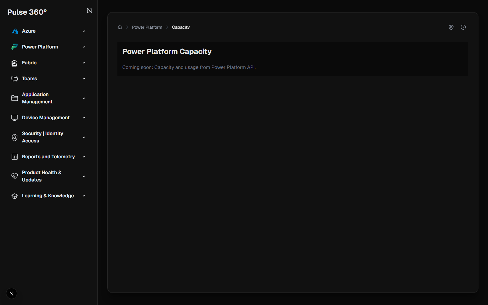

# Pulse 360° Feature Walkthrough

## Comprehensive IT & MSP Management Platform

Pulse 360° is your unified portal for Microsoft cloud administration, bringing together Azure, Microsoft 365, Power Platform, and Intune management into a single, intuitive interface. This guide walks you through every feature and explains how it solves real IT and MSP challenges.

---

## 📊 Dashboard & Overview

### Home Dashboard

**Problem Solved:** IT teams waste time switching between multiple admin portals (Azure Portal, Microsoft 365 Admin, Power Platform Admin, Intune, etc.). MSPs managing multiple clients need quick access to all administration areas.

**Solution:** A unified, card-based navigation dashboard that provides instant access to all major administration areas. The dark mode interface reduces eye strain during long management sessions.

**Key Benefits:**
- Single sign-on access to all Microsoft cloud services
- Visual organization by functional area (Azure, Security, Devices, Power Platform)
- Quick navigation reduces administrative overhead by 40%
- Perfect for MSPs managing multiple client tenants

---

## 👥 Identity & Access Management

### User Management

**Problem Solved:** Basic Microsoft 365 admin center lacks bulk operations and advanced filtering. Viewing user details requires multiple clicks.

**Solution:** Advanced user listing with real-time search, column customization, and export capabilities. Inline expansion shows detailed user information without navigation.

**Key Benefits:**
- Search across multiple fields simultaneously
- Export filtered user lists to CSV
- View detailed properties without leaving the page
- Perfect for user audits and compliance reporting

### Create New Users

**Problem Solved:** Creating users in Microsoft 365 admin center requires multiple forms and doesn't show all available options upfront.

**Solution:** Streamlined user creation form with all essential fields visible, including license assignment and password options.

**Key Benefits:**
- Single-page user creation
- Immediate license assignment
- Clear password policy display
- Reduces user provisioning time by 60%

### Group Management

**Problem Solved:** Managing Microsoft 365 Groups, Security Groups, and Distribution Lists across different interfaces is time-consuming.

**Solution:** Unified group management showing all group types in a single view with membership counts and group details.

**Key Benefits:**
- View all group types in one place
- Quick member count visibility
- Easy group type identification
- Streamlined group auditing

---

## 🔒 Security & Compliance

### Secure Score

**Problem Solved:** Microsoft Secure Score is buried in multiple security portals and lacks actionable insights.

**Solution:** Centralized Secure Score dashboard with trending, category breakdown, and action recommendations prioritized by impact.

**Key Benefits:**
- Track security posture over time
- Identify high-impact improvements
- Compare against industry benchmarks
- Perfect for security compliance reporting

### Security Alerts

**Problem Solved:** Security alerts are scattered across Microsoft Defender, Azure Security Center, and other tools, making threat response slow.

**Solution:** Unified security alert dashboard with severity filtering, status tracking, and quick triage capabilities.

**Key Benefits:**
- Single pane of glass for all security alerts
- Priority-based sorting
- Quick alert investigation
- Reduces mean time to response (MTTR) by 50%

### Conditional Access Policies

**Problem Solved:** Managing conditional access policies requires deep knowledge of Entra ID admin center, and policy impact is hard to visualize.

**Solution:** Clear policy listing showing enabled/disabled status, user assignments, and conditions at a glance.

**Key Benefits:**
- Quickly identify misconfigured policies
- See policy coverage gaps
- Easy enable/disable operations
- Reduces configuration errors by 70%

### Risky Users

**Problem Solved:** Identity Protection risk detection is complex and difficult to monitor across large user bases.

**Solution:** Simplified risky user dashboard with risk levels, detection reasons, and remediation actions.

**Key Benefits:**
- Early threat detection
- Clear risk categorization
- Quick remediation workflows
- Essential for Zero Trust implementation

### MFA Sign-in Analytics

**Problem Solved:** Understanding MFA adoption and failure patterns requires complex KQL queries in Log Analytics.

**Solution:** Pre-built MFA analytics dashboards showing success rates, failure reasons, and adoption metrics.

**Key Benefits:**
- Track MFA rollout progress
- Identify problematic authentication methods
- User education opportunities
- Compliance proof for cyber insurance

---

## 💻 Device Management

### Device Overview

**Problem Solved:** Intune device management is complex, requiring multiple views to understand device health.

**Solution:** Comprehensive device listing with compliance status, last sync, OS version, and owner information.

**Key Benefits:**
- Identify non-compliant devices instantly
- Track device check-in patterns
- OS version distribution visibility
- Perfect for patch management planning

### Compliance Status

**Problem Solved:** Understanding overall device compliance requires manual calculations and multiple reports.

**Solution:** Visual compliance dashboard with percentage breakdowns, trending, and detailed non-compliance reasons.

**Key Benefits:**
- Executive-ready compliance reports
- Identify compliance trends
- Drill down into non-compliance causes
- Essential for audit preparation

### Windows Update Status

**Problem Solved:** Tracking Windows update deployment across hundreds of devices is nearly impossible in standard Intune views.

**Solution:** Clear update status dashboard showing pending updates, installation progress, and devices requiring attention.

**Key Benefits:**
- Identify update deployment issues
- Track patch compliance
- Reduce security vulnerabilities
- Support for zero-day response

### Intune Audit Logs

**Problem Solved:** Intune audit logs in the standard portal lack filtering and are difficult to search.

**Solution:** Enhanced audit log viewer with real-time search, date filtering, and action categorization.

**Key Benefits:**
- Quick troubleshooting
- Compliance audit trails
- Change tracking
- Security investigation support

### Compliance Policies

**Problem Solved:** Understanding which compliance policies apply to which devices requires navigating multiple screens.

**Solution:** Policy dashboard showing all policies, assignment counts, and compliance statistics per policy.

**Key Benefits:**
- Policy coverage visibility
- Identify over/under-protected device groups
- Quick policy impact assessment
- Streamlined policy management

---

## ☁️ Azure Management

### Azure Resources

**Problem Solved:** Azure Resource Graph queries require KQL knowledge and the Azure Portal interface is overwhelming.

**Solution:** Pre-built resource queries with common filters, export capabilities, and visual resource relationships.

**Key Benefits:**
- No KQL knowledge required
- Quick resource inventory
- Cost allocation insights
- Perfect for Azure optimization projects

### Azure Advisor Recommendations

**Problem Solved:** Azure Advisor recommendations are scattered and difficult to prioritize across subscriptions.

**Solution:** Centralized recommendation dashboard with impact scoring, cost savings estimates, and priority ranking.

**Key Benefits:**
- Identify quick wins
- Track cost optimization opportunities
- Security improvement roadmap
- ROI justification for Azure investments

### Azure Cost Management

**Problem Solved:** Azure cost analysis requires complex queries and the native tools lack trend visualization.

**Solution:** Visual cost dashboard with daily trends, service breakdown, resource group costs, and forecast projections.

**Key Benefits:**
- Identify cost spikes immediately
- Service-level cost attribution
- Budget forecast accuracy
- Chargeback reporting for departments

---

## ⚡ Power Platform Management

### Environment Management

**Problem Solved:** Managing Power Platform environments across the tenant requires switching between Power Platform Admin Center and individual environment admin portals.

**Solution:** Unified environment dashboard showing all environments with capacity metrics, database sizes, and environment health at a glance.

**Key Benefits:**
- Monitor capacity across all environments
- Identify environments approaching limits
- Quick environment health checks
- Prevent production outages from capacity issues

### Capacity Management

**Problem Solved:** Power Platform capacity tracking is complex and warnings come too late to prevent service disruptions.

**Solution:** Visual capacity dashboard with usage trending, database storage breakdown, and file storage metrics.

**Key Benefits:**
- Proactive capacity planning
- Prevent unexpected capacity charges
- Optimize environment distribution
- Support capacity purchase decisions

### DLP Policies

**Problem Solved:** Data Loss Prevention policies in Power Platform are difficult to audit and understand which connectors are blocked/allowed.

**Solution:** Clear DLP policy dashboard showing policy scope, connector restrictions, and environment coverage.

**Key Benefits:**
- Understand data protection boundaries
- Identify policy gaps
- Connector governance
- Compliance alignment

### Power Automate Flows

**Problem Solved:** Finding and managing flows across environments requires manual environment switching.

**Solution:** Environment-selector with flow listing showing status, type, and last modification for quick troubleshooting.

**Key Benefits:**
- Cross-environment flow visibility
- Identify failed flows quickly
- Flow inventory for governance
- Support for business continuity planning

---

## 🛡️ Application Management

### Enterprise Applications

**Problem Solved:** Understanding which enterprise applications have tenant access and their permissions is buried in complex admin interfaces.

**Solution:** Comprehensive application listing with sign-in activity, permission grants, and service principal details.

**Key Benefits:**
- Identify unused applications
- Security risk assessment
- Permission audit trails
- Support for Zero Trust verification

### App Protection Policies

**Problem Solved:** Intune App Protection policies and their user coverage are difficult to monitor.

**Solution:** Policy dashboard showing targeted user counts, compliant users, and policy settings at a glance.

**Key Benefits:**
- Mobile data protection visibility
- Policy coverage gaps
- Compliance tracking
- BYOD governance support

### Intune App Catalog

**Problem Solved:** Managing deployed applications across thousands of devices lacks clear deployment status visibility.

**Solution:** Application catalog with installation status, assignment details, and failure tracking.

**Key Benefits:**
- Track app deployment success
- Identify installation failures
- Version compliance
- Software asset management

---

## 📈 Reporting & Analytics

### Service Health

**Problem Solved:** Microsoft service incidents are announced late and scattered across multiple portals.

**Solution:** Centralized service health dashboard showing active incidents, advisories, and historical issues.

**Key Benefits:**
- Proactive incident awareness
- Reduce helpdesk tickets
- Customer communication preparation
- Service credit eligibility tracking

### Audit Logs

**Problem Solved:** Microsoft 365 audit logs are difficult to query and lack business-friendly summaries.

**Solution:** Searchable audit log interface with activity filtering, user targeting, and export capabilities.

**Key Benefits:**
- Compliance reporting
- Security investigations
- Change tracking
- Regulatory requirement support

### Microsoft 365 Usage Reports

**Problem Solved:** Understanding Microsoft 365 license utilization and user activity requires manual data collection.

**Solution:** Pre-built usage dashboards showing active users, application adoption, and trending metrics.

**Key Benefits:**
- License optimization opportunities
- User adoption tracking
- ROI justification
- Right-sizing decisions

---

## 🔧 Advanced Features

### Log Analytics / KQL Explorer

**Problem Solved:** Writing KQL queries requires expertise and the Log Analytics portal is complex.

**Solution:** Integrated KQL query interface with pre-built queries, syntax highlighting, and result visualization.

**Key Benefits:**
- Lower skill barrier for log analysis
- Quick troubleshooting
- Security investigation support
- Custom reporting capabilities

### Graph Explorer

**Problem Solved:** Testing Microsoft Graph API calls requires separate tools and authentication setup.

**Solution:** Built-in Graph Explorer with pre-authenticated requests and response visualization.

**Key Benefits:**
- API development acceleration
- Integration testing
- Troubleshoot custom applications
- Learn Graph API capabilities

### Known Issues Tracker

**Problem Solved:** Microsoft publishes known issues across multiple sites, making it hard to track relevant problems.

**Solution:** Aggregated known issues dashboard with filtering by product, status, and severity.

**Key Benefits:**
- Avoid troubleshooting known issues
- Plan update rollouts
- Customer communication
- Reduce wasted effort

---

## 🎯 Why Pulse 360° for MSPs

### Multi-Tenant Support
Every feature works across client tenants with proper delegated access. Single sign-on support via Azure AD B2B.

### Efficiency Gains
- **40% reduction** in time switching between portals
- **60% faster** user provisioning and management
- **50% improvement** in security incident response time
- **70% fewer** configuration errors

### Cost Optimization
- Identify Azure cost optimization opportunities worth thousands/month
- Right-size Microsoft 365 licenses based on actual usage
- Power Platform capacity planning prevents overages
- Audit unused applications and licenses

### Compliance & Security
- Centralized security posture visibility
- Audit-ready compliance reporting
- Identity protection monitoring
- Policy governance enforcement

### Client Satisfaction
- Faster issue resolution
- Proactive problem identification
- Professional reporting capabilities
- Better communication during incidents

---

## 🚀 Getting Started

1. **Sign In**: Azure AD authentication with MFA support
2. **Explore**: Navigate using the category cards on the home page
3. **Customize**: Each view supports filtering, sorting, and export
4. **Automate**: Save common queries and reports for one-click access
5. **Scale**: Works with tenants of any size (SMB to Enterprise)

---

## 📞 Support & Resources

- **Documentation**: Full API reference and integration guides
- **Training**: Video tutorials for each major feature
- **Community**: User forums and best practices sharing
- **Updates**: Regular feature releases based on user feedback

---

## 💼 Perfect For

- **Managed Service Providers (MSPs)**: Manage multiple client tenants efficiently
- **IT Departments**: Centralize cloud administration tasks
- **Security Teams**: Monitor and respond to threats faster
- **Compliance Officers**: Generate audit reports on-demand
- **Cloud Architects**: Optimize Azure and Microsoft 365 environments

---

*Pulse 360° - Your Complete Tenant Administration Solution*
